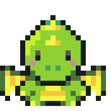

<h1> Hii! 👾👋 </h1>

## About me ✍️

- 👩‍💻 Currently learning more about **ReactJS**
- 👾 Interested in **Game Development**
- 🎮 Learning to create 2D pixel games in [Godot Engine](https://godotengine.org/).

## Check out some of my work!
- 🕹️ Created a game, 2 persons team, check it out here: [Play Fishekai](https://itch.io/jam/-pixel-game-jam-2024/rate/2720757)

<!-- ## Languages and Tools

WIP -->

### #30NitesOfCode pet 😼: [Check out my latest progress!](https://www.codedex.io/@kriztin/30-nites-of-code)

<h3>Blaze 2.0 & Blaze</h3>

Started again with a new pet! Ready to take on another challenge!

